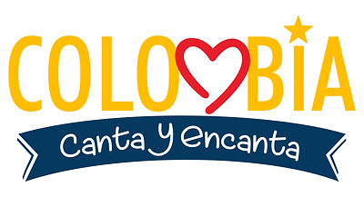

<!-- BANNER -->

  

   &nbsp;<b>Open to Work</b>

   
   
  

<h3 align="center">Sobre mí</h3>

Full-Stack Developer con casi 2 años de experiencia liderando proyectos de principio a fin **en producción**, con React, Node.js y bases de datos SQL/NoSQL (PostgreSQL, MongoDB). Tomo decisiones de arquitectura de forma autónoma y aprendo rápido entre stacks distintos cuando el proyecto lo exige.

He trabajado en sectores asociados a la construcción, consultoría y cultura. He tenido buenas experiencias trabajando con stakeholders técnicos como no técnicos, traduciendo ambigüedad de negocio en decisiones técnicas concretas. Me interesa especialmente el cruce entre **desarrollo web e inteligencia artificial**.

  🏆 <b>1</b> hackathon ganado &nbsp;·&nbsp; 🚀 <b>4</b> proyectos destacados en producción &nbsp;·&nbsp; 💼 <b>~2</b> años liderando desarrollo full-stack

<h3 align="center">Proyectos Destacados</h3>

<table border="1" cellpadding="12" cellspacing="0"><tr><td align="center">

<h3 align="center">01 &nbsp; Colombia Canta y Encanta</h3>

   
  

Plataforma cultural con inscripciones, tienda y gestión de eventos para una asociación colombiana real, con pagos y autenticación multifactor.

  
  

  <b>Impacto:</b> reemplazó un proceso 100% manual por WhatsApp por una operación digital autónoma con pagos reales. 
  
  

</td></tr></table>

<table border="1" cellpadding="12" cellspacing="0"><tr><td align="center">

<h3 align="center">02 &nbsp; Coco B Isla</h3>

   
  

Plataforma de reservas para resort/villa con CMS headless y chatbot con IA, construida en un hackathon competitivo. <b>Equipo ganador.</b>

  

  <b>Impacto:</b> sistema de reservas en tiempo real y chatbot con IA en producción, dentro del plazo del hackathon. 
  
  

</td></tr></table>

<table border="1" cellpadding="12" cellspacing="0"><tr><td align="center">

<h3 align="center">03 &nbsp; Constructora Hidrorural</h3>

   
  

Plataforma web institucional para un cliente real de construcción, con endpoint de cotización y múltiples capas de seguridad en producción.

  

  <b>Impacto:</b> mejoró la visibilidad digital de la empresa en ~40%. 
  
  
  

</td></tr></table>

<table border="1" cellpadding="12" cellspacing="0"><tr><td align="center">

<h3 align="center">04 &nbsp; Around The U.S.</h3>

Red social full-stack con registro, login y sesión persistente vía JWT, con una migración adicional a React y Context API.

  
  

  <b>Impacto:</b> 10 endpoints REST funcionales, desplegada en producción. 
  
  
  

</td></tr></table>

<h3 align="center">Stack Tecnológico</h3>

  

<b>Ver stack completo</b>

 

<h4 align="center">Frontend</h4>

<h4 align="center">Backend</h4>

<h4 align="center">Bases de Datos</h4>

<h4 align="center">IA y Automatización</h4>

<h4 align="center">Herramientas y Despliegue</h4>

<h3 align="center">Certificaciones</h3>

<b>Anthropic</b> — Claude with the Anthropic API

RAG · Tool Use · Streaming · Agentes · MCP · Workflows

<b>Excel Avanzado · Power BI · SQL Server</b>

Tablas dinámicas · DAX · Funciones avanzadas

<h3 align="center">Contacto</h3>

<table align="center">
  <tr>
    <td align="center">
       
      <b>LinkedIn</b>
    </td>
    <td align="center">
       
      <b>Portafolio</b>
    </td>
    <td align="center">
       
      <b>Email</b>
    </td>
  </tr>
</table>

<!-- CTA -->

  

<!-- VISITOR COUNTER -->

  

<!-- FOOTER -->

  

