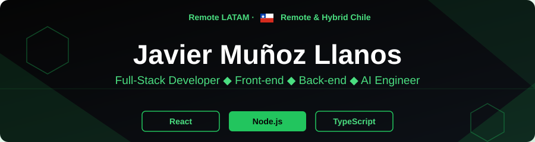
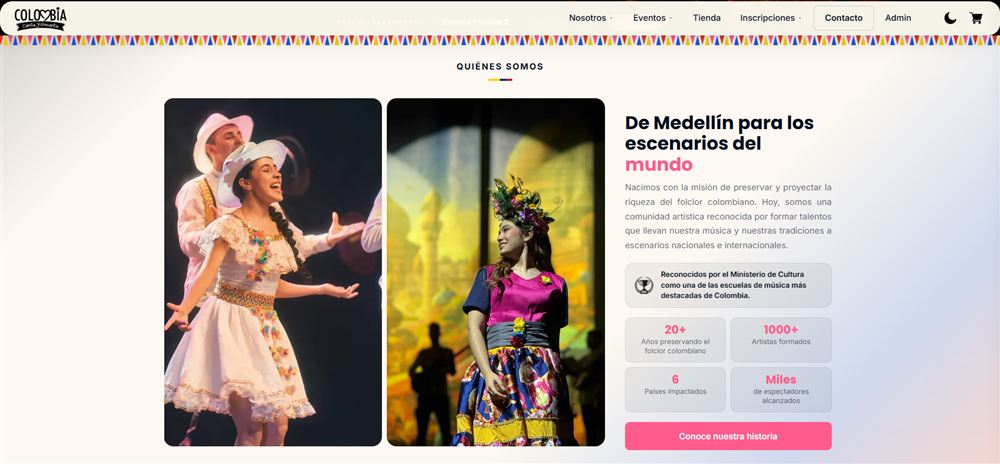
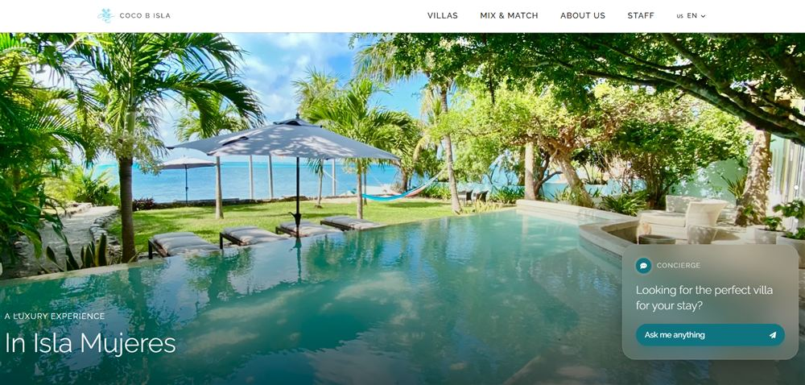
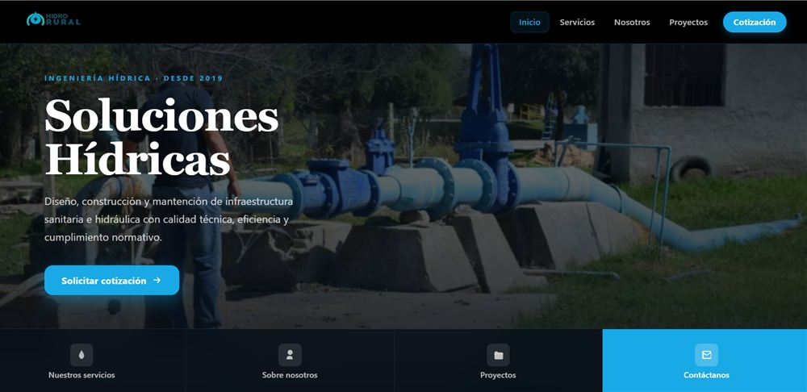
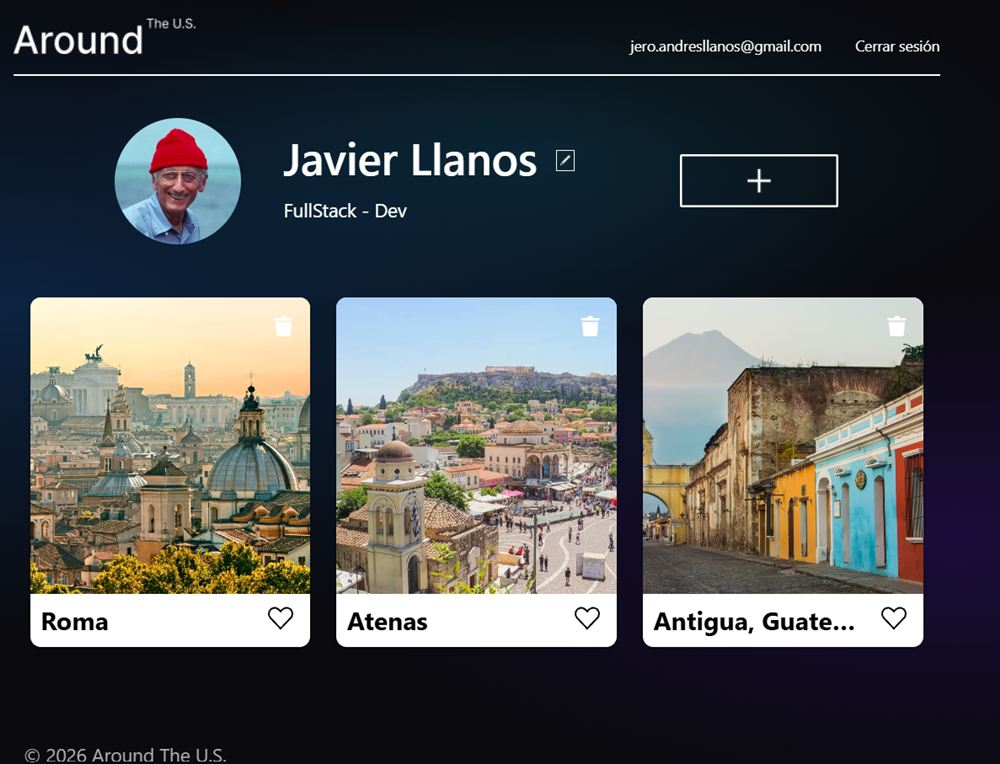

<!-- BANNER -->

  

   &nbsp;<b>Open to Work</b>

  

<h3 align="center">About Me</h3>

<table align="center"><tr><td width="640">

- 👋 2 years building software. Always end-to-end and **in production**
- 🧩 Fast learner, resourceful, communicative, and motivated
- 🏗️ Experience working with stakeholders from construction, culture, and consulting, both technical and non-technical
- 🤖 Right now what excites me most is mixing **web development with AI**

</td></tr></table>

<h4 align="center">Experiences Worth Remembering</h4>

<table align="center"><tr><td width="640">

- 🏆 Won a hackathon with **Coco B Isla** (TripleTen, August 2026)
- 🎨 **Colombia Canta y Encanta**, my first custom-built software (2026)
- 🤝 **Hidrorural**, the first client who trusted me
- 📈 More knowledge will bring more experience

</td></tr></table>

<h3 align="center">Tech Stack</h3>

<b>View full stack</b>

 

<b>Frontend:</b> 

<b>Backend:</b> 

<b>Databases:</b> 

<b>AI &amp; Automation:</b> 

<b>Tools &amp; Deployment:</b> 

<h3 align="center">Featured Projects</h3>

<table border="1" cellpadding="10" cellspacing="0">
<tr>
<td width="50%" valign="top" align="center">

<h3 align="center">Colombia Canta y Encanta</h3>

  Cultural platform with event registration, an online store, and event management for a real Colombian association, with payments and multi-factor authentication.  
  
    
  <b>Impact:</b> replaced a 100% manual WhatsApp process with a self-service digital operation with real payments. 
  
  

</td>
<td width="50%" valign="top" align="center">

<h3 align="center">Coco B Isla</h3>

  Booking platform for a resort/villa with a headless CMS and an AI chatbot, built during a competitive hackathon. <b>Winning team.</b>  
    
  <b>Impact:</b> real-time booking system and AI chatbot in production, delivered within the hackathon deadline. 
  
  

</td>
</tr>
<tr>
<td width="50%" valign="top" align="center">

<h3 align="center">Constructora Hidrorural</h3>

  Institutional website for a real construction client, with a quote-request endpoint and multiple security layers in production.  
    
  <b>Impact:</b> improved the company's digital visibility by ~40%. 
  
  
  

</td>
<td width="50%" valign="top" align="center">

<h3 align="center">Around The U.S.</h3>

  Full-stack social network with registration, login, and persistent session via JWT, with an additional migration to React and Context API.  
  
    
  <b>Impact:</b> 10 working REST endpoints, deployed to production. 
  
  
  

</td>
</tr>
</table>

<h3 align="center">Contact</h3>

<table align="center">
  <tr>
    <td align="center">
       
      <b>LinkedIn</b>
    </td>
    <td align="center">
       
      <b>Portfolio</b>
    </td>
    <td align="center">
       
      <b>Email</b>
    </td>
  </tr>
</table>

<!-- CTA -->

  

<!-- VISITOR COUNTER -->

  

<!-- FOOTER -->

  

